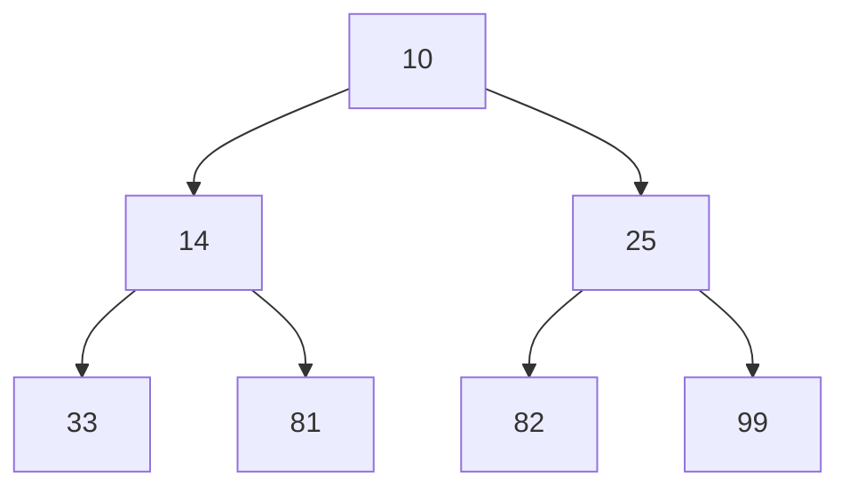
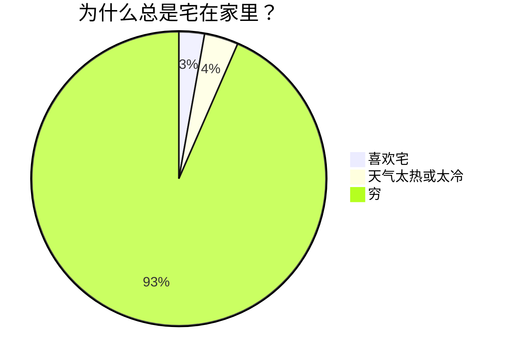
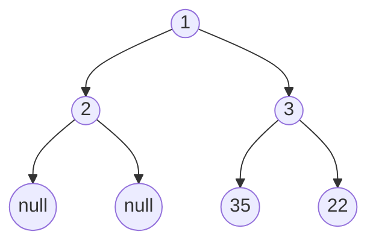

### 二叉树很重要

测试对图的支持
### 堆
完全二叉树，
最大堆：父节点>= 子节点
最小堆：父节点<= 子节点

逻辑结构是一颗二叉树，但物理结构是一个数组。
数组：适合连续存储+节省空间（回顾堆栈模型）

```mermaid
graph 
10 --> 14
10 --> 25

14 --> 33
14 --> 81

25 --> 82
25 --> 99
```

```mermaid
pie
    title 为什么总是宅在家里？
    "喜欢宅" : 15
    "天气太热或太冷" : 20
    "穷" : 500
```

``` mermaid
graph TB;
1((1))-->2((2))
2((2))-->null((null))
2((2))-->null2((null))
1((1))-->3((3))
3((3))-->4((35))
3((3))-->22((22))
```
